# Background Model of LIGHT-1

Using backgronud spectra along the trajectory of LIGHT-1, generated from SPENVIS we use a GEANT-4 simulation to estimate the number of charged particles that deposit energy on the detector. Hopefully this can be used to backestmate the threshold.

## SPENVIS

The charge particle fluxes along the trajectory of LIGHT-1 were generated in ESA’s [Space Environment Information System](https://www.spenvis.oma.be/help.php). 

In particular the particle fluxes examined along the track of the golden October are the following:

1. Trapped Protons (inlcuding angular distribution)
2. Trapped Electrons (including angular distribution)
3. Solar Particle Fluence
4. Solar Proton Flux
5. Extragalactic Cosmic rays

The following parameters were used for the simulation.

### Grid Generator

The orbital path is specified using the following parameters that we got from STK. The complete data can be found [here](./Atmospheric_Spectra_SPENVIS/INPUT_DATA/LIGHT-1_51509_Pirate_Data.csv).

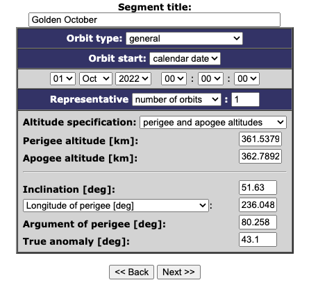

This is the output

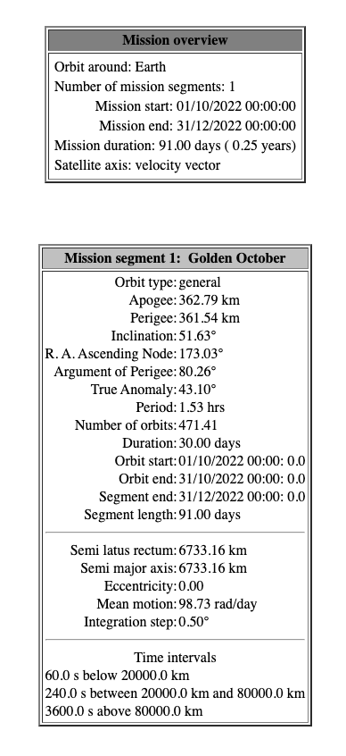

If anyone was wondering here are the orbit results

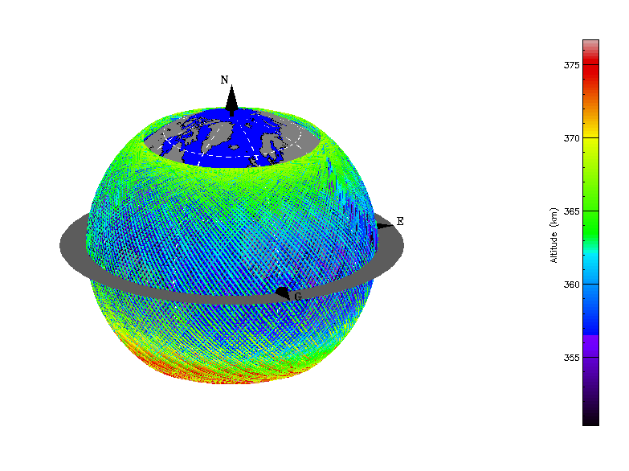

### Trapped Particle Sources

We evaluated the flux of trapped particles at solar maximum.

1. Species: Electrons, Protons
2. Threshold for exposure 1 particle/$cm^2$/$s$

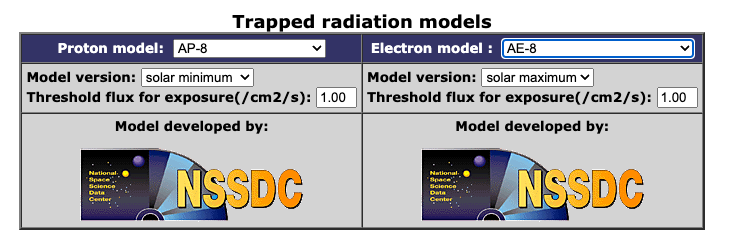

### Trapped Proton Anisotropy Model

No parameters just generated it :). Generates the angular distribution of the proton flux

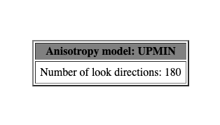

### Solar Particle Fluence

Calculate the fluence of solar protons and heavy ions from the sun, along the orbit. Turns out it’s a lot.

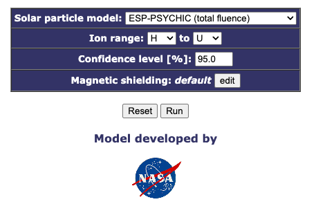

### Galactic Cosmic Rays

Get galactic cosmic rays throught the mission time from registered solar models.

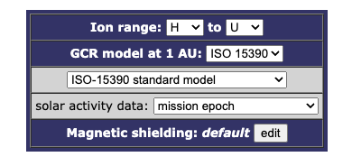

## Results

Here are result spectra

**Trapped Protons**

|                         Average Flux                         |                    Flux throguhout orbit                     |
| :----------------------------------------------------------: | :----------------------------------------------------------: |
|  | 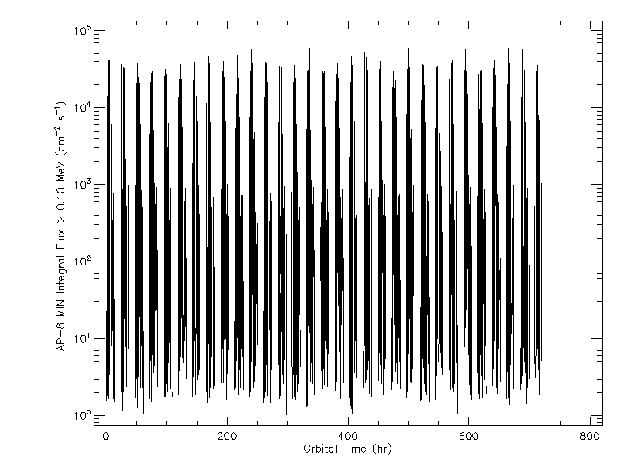 |

**Trapped Electrons**

|                         Average Flux                         |                    Flux throguhout orbit                     |
| :----------------------------------------------------------: | :----------------------------------------------------------: |
| 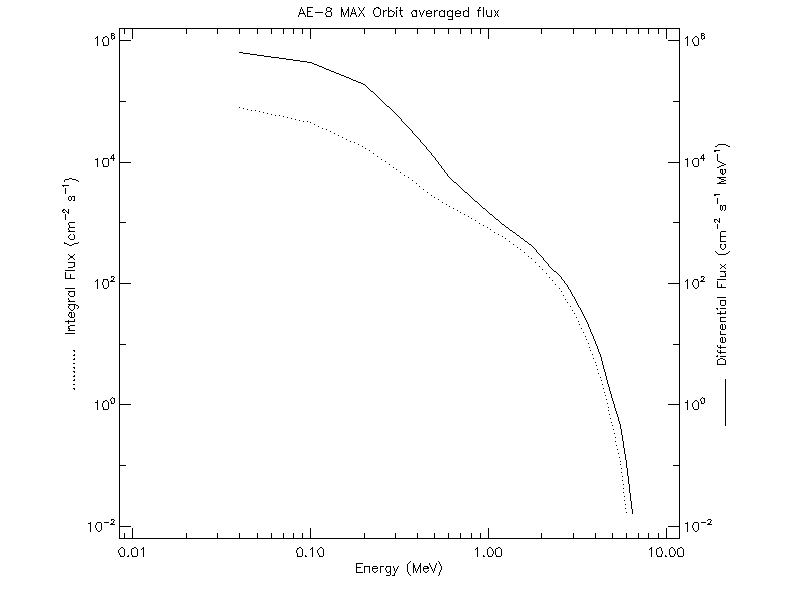 | 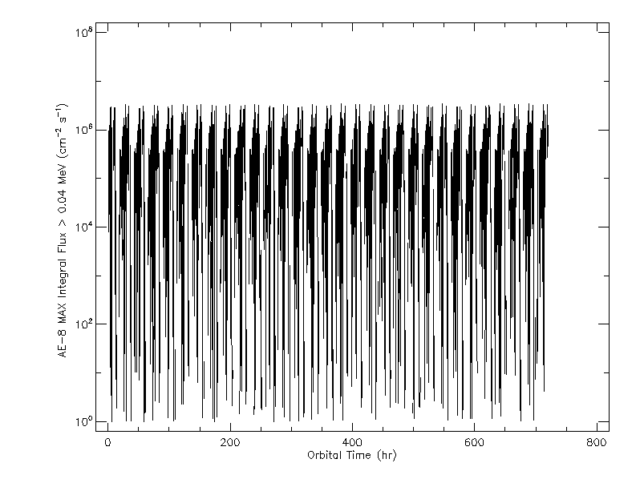 |

**Angular distribution of proton flux**

| Angular Distribution [0.1, 1, 10, 100 MeV]                   |                                                              |
| ------------------------------------------------------------ | ------------------------------------------------------------ |
| 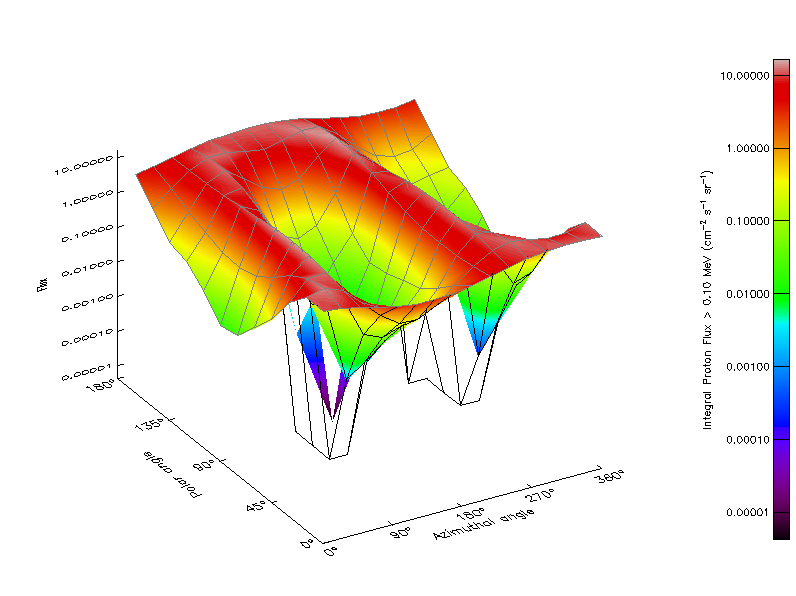 | 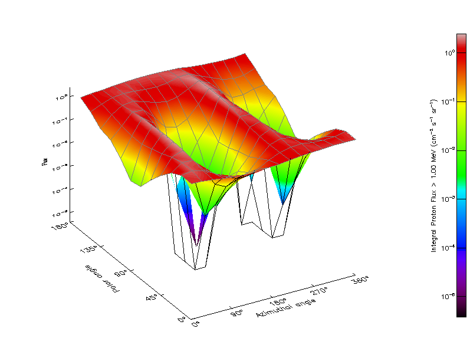 |
| 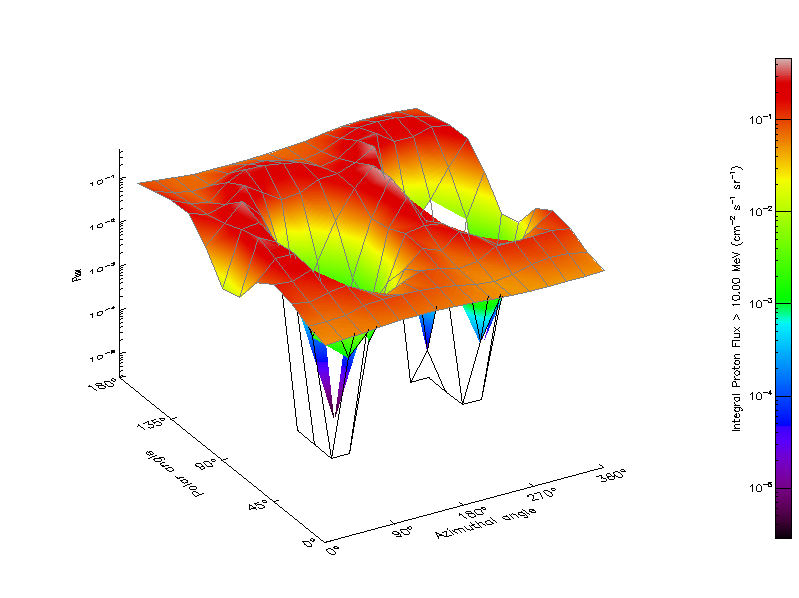 | 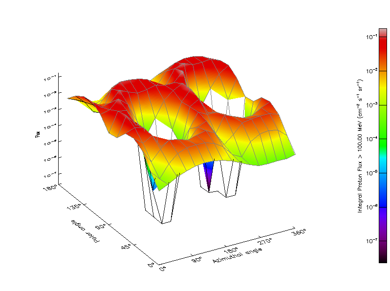 |

**Solar Particle Fluence**

|                           Protons                            |                     Heavy Ions (alphas)                      |
| :----------------------------------------------------------: | :----------------------------------------------------------: |
| 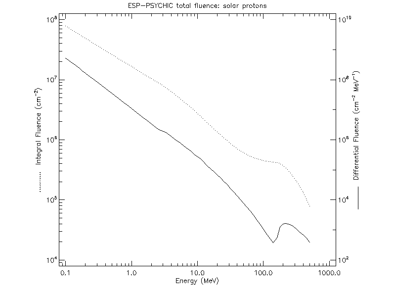 | 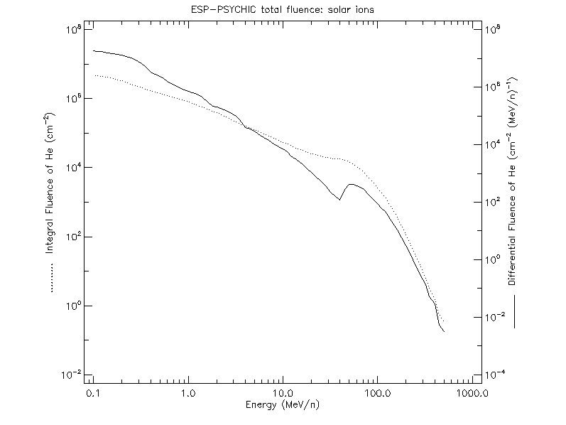 |

**Galactic Cosmic Rays**

Extragalactic Proton Flux

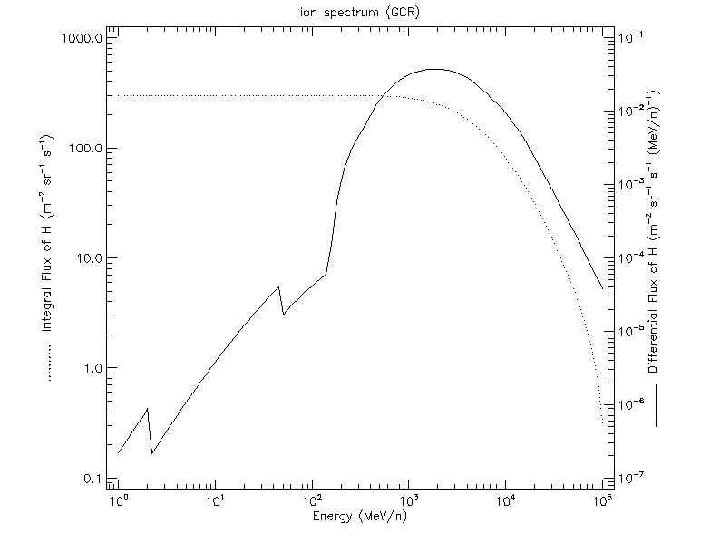
